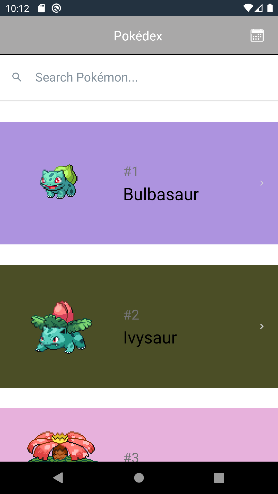
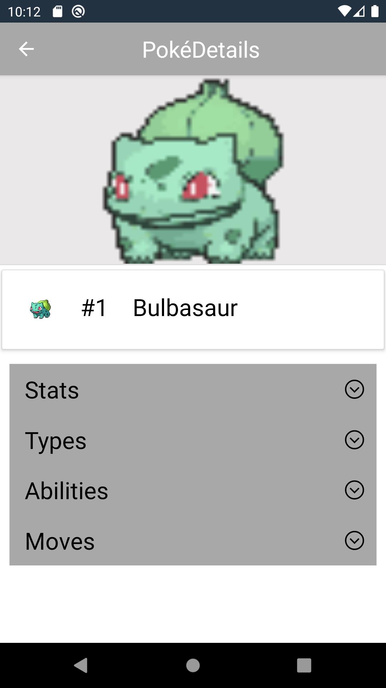
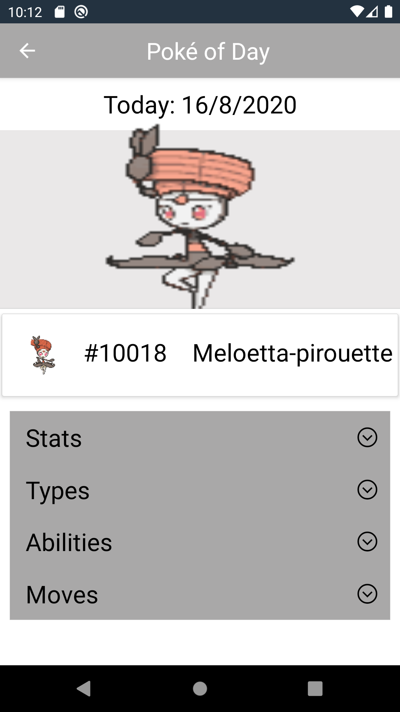

# PokedexApp
Pokedex App with React-Native

<table>
  <tr>
    <td>Poke List</td>
     <td>Poke Detail</td>
     <td>Poke of Day</td>
  </tr>
  <tr>
    <td></td>
    <td></td>
     <td></td>
  </tr>
</table>
